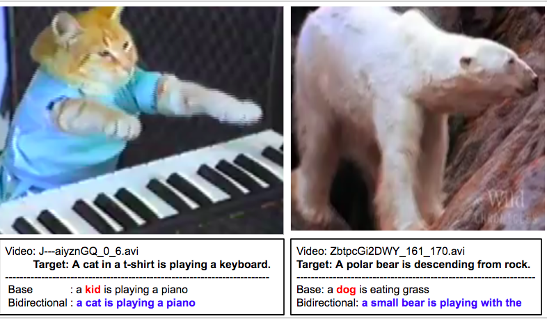
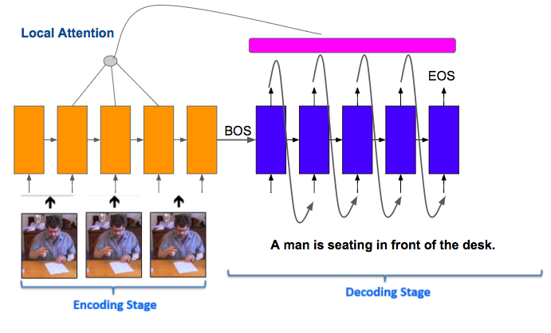
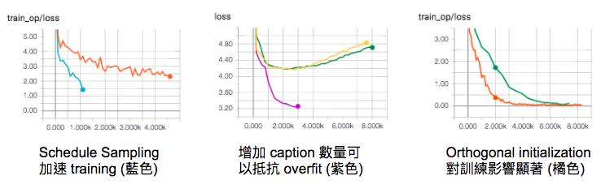

# Video Caption
## NTU 2017 Fall MLDS: Assignment 2

Describe the videos based on content. This task is to generate the description for the given video.

## Results

## Architecture: Seq2Seq
Simply use Seq2Seq is good enough to perform the task.  

## Experiment & Parameters
Some hints about training  

* epoch: 200
* batch size: 64
* cell type: LSTM
* initalization: Orthogonal
* hidden size: 256
* layers: 2
* dropout: 0.5
* optimizer: RMSProp
* learning rate: 0.0001
* learning rate decay rate: 0.25
* decay epoch: 50
* loss function: Seqeunce Loss (cross entropy)
* attention: local (atten)

## Dataset
MSVD : 1450 videos for training and 100 videos for testing 
Link: https://drive.google.com/file/d/0B18IKlS3niGFNlBoaHJTY3NXUkE/view
